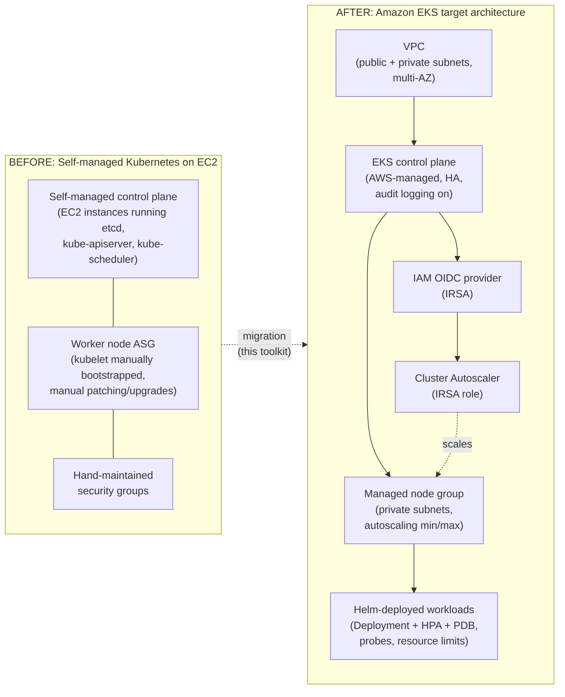

# EKS Migration & Helm Deployment Toolkit

Stuck running Kubernetes by hand on plain EC2 instances? This toolkit is a tested, ready-to-adapt blueprint for moving that cluster to Amazon EKS — and deploying apps onto it the repeatable way — without your team relearning Kubernetes from scratch.

## Problem & Solution

**The problem:** a lot of growing startups and SMBs end up running Kubernetes themselves on bare EC2 instances — someone stood up `kubeadm` once, and now the team is manually patching control-plane nodes, hand-editing security groups, and hoping the cluster survives the next AMI upgrade. It works, until it doesn't: no managed HA control plane, no standard way to scale, and a security posture that's whatever the last engineer remembered to lock down.

**The solution:** this repo is a working reference implementation — Terraform modules, a Helm chart, and an audit script — for the exact migration path: self-managed EC2 Kubernetes → Amazon EKS with a managed control plane, managed node groups, IAM Roles for Service Accounts (IRSA), and applications deployed through versioned Helm charts instead of ad hoc `kubectl apply`. Every piece is automatically tested (see [Running tests](#running-tests)) so you can trust it as a starting point for a real engagement, not just read it as a tutorial.

## Features

- **VPC Terraform module** — multi-AZ public/private subnets, EKS-required subnet tagging, and a cost toggle to disable the NAT gateway while iterating on a plan.
- **EKS Terraform module** — managed EKS cluster with control-plane audit logging on by default, a managed node group in private subnets, an IAM OIDC provider for IRSA, and a least-privilege IRSA role for the Kubernetes Cluster Autoscaler.
- **Typed, validated Terraform variables** — `validation` blocks catch bad input (mismatched subnet/AZ counts, invalid CIDRs, `min > max` node sizing) at `terraform plan` time.
- **Terraform native tests** — `*.tftest.hcl` files with `mock_provider "aws" {}` run the whole test suite with zero AWS credentials or network access.
- **Helm chart for a sample workload** — Deployment, Service, HorizontalPodAutoscaler, PodDisruptionBudget, resource requests/limits, and readiness/liveness probes, using a small public demo image (no custom app code implied).
- **Chart validation pipeline** — `helm lint`, `helm template` piped through `kubeconform` against the Kubernetes JSON schemas, and real `helm-unittest` unit tests.
- **Migration readiness audit script** — scans a directory of existing plain Kubernetes YAML for patterns that break or degrade on EKS defaults: `hostPath` volumes, missing resource limits, deprecated/removed API versions, privileged containers, and `hostNetwork` usage.
- **CI on every push** — Terraform fmt/validate/test, Helm lint/template/kubeconform/unittest, and ShellCheck, all running without touching a real AWS account.

## Tech stack


## Screenshots / demo

No live deployment yet — this repo intentionally never runs `terraform apply` in CI (see [Deployment notes](#deployment-notes)). Once applied against a real AWS account, screenshots of the plan output, the running EKS cluster, and the deployed sample workload will live in [`docs/screenshots/`](docs/screenshots/README.md).

## Architecture overview

Full write-up with component-by-component notes: [`docs/architecture.md`](docs/architecture.md).



## Local setup

### Prerequisites

- [Terraform](https://developer.hashicorp.com/terraform/downloads) >= 1.5 (tested with 1.9.8)
- [Helm](https://helm.sh/docs/intro/install/) 3.x
- [kubeconform](https://github.com/yannh/kubeconform) (for chart schema validation)
- [ShellCheck](https://www.shellcheck.net/) (for linting the audit script)
- An AWS account + credentials — **only required if you intend to actually apply the Terraform** (see [Deployment notes](#deployment-notes)); everything else in this repo runs without one.

### Commands

```bash
# Clone and enter the repo
git clone <this-repo-url>
cd eks-migration-toolkit

# Terraform: format, validate, and initialize each root/module
terraform fmt -recursive terraform/
(cd terraform/modules/vpc && terraform init -backend=false && terraform validate)
(cd terraform/modules/eks && terraform init -backend=false && terraform validate)
(cd terraform/environments/dev && terraform init -backend=false && terraform validate)

# Copy the example tfvars before ever planning against a real account
cp terraform/environments/dev/terraform.tfvars.example terraform/environments/dev/terraform.tfvars
# edit terraform.tfvars with your own values

# Helm: render the sample workload chart locally
helm template sample-workload helm/sample-workload

# Migration readiness script: audit the bundled demo fixtures
cp .env.example .env
./scripts/migration-readiness-check.sh scripts/fixtures
```

## Environment variables / tfvars

### `terraform/environments/dev/terraform.tfvars` (copy from `terraform.tfvars.example`)

| Variable | Description | Example |
|---|---|---|
| `aws_region` | AWS region to deploy into | `us-east-1` |
| `environment` | Environment name (`dev`/`staging`/`prod`) | `dev` |
| `name_prefix` | Prefix for all resource names | `acme-eks-demo` |
| `vpc_cidr_block` | CIDR block for the VPC | `10.42.0.0/16` |
| `azs` | Availability zones to use | `["us-east-1a", "us-east-1b"]` |
| `public_subnet_cidrs` / `private_subnet_cidrs` | Subnet CIDRs, index-aligned with `azs` | see file |
| `enable_nat_gateway` / `single_nat_gateway` | NAT gateway cost/HA toggles | `true` / `true` |
| `cluster_version` | Kubernetes minor version for EKS | `1.30` |
| `node_instance_types`, `node_desired_size`, `node_min_size`, `node_max_size`, `node_capacity_type` | Managed node group sizing | see file |
| `endpoint_public_access` / `public_access_cidrs` | EKS API endpoint exposure — restrict `public_access_cidrs` for anything beyond a demo | `true` / `["0.0.0.0/0"]` |

**Never commit a real `terraform.tfvars`** — it's gitignored. Authenticate to AWS via the CLI, environment variables, or an assumed role; never put credentials in a `.tfvars` file.

### `.env` (copy from `.env.example`, used by `scripts/migration-readiness-check.sh`)

| Variable | Description | Default |
|---|---|---|
| `MANIFEST_DIR` | Directory of Kubernetes manifests to audit | `./scripts/fixtures` |
| `STRICT_MODE` | `true` to exit non-zero when issues are found (for CI gating) | `false` |

## Running tests

```bash
# Terraform native tests (mocked AWS provider -- no credentials needed)
cd terraform/tests
terraform init
terraform test

# Terraform formatting and validation
terraform fmt -check -recursive terraform/
(cd terraform/modules/vpc && terraform validate)
(cd terraform/modules/eks && terraform validate)
(cd terraform/environments/dev && terraform validate)

# Helm chart lint
helm lint helm/sample-workload

# Full chart validation pipeline: lint + template + kubeconform (+ helm-unittest if installed)
./helm/tests/validate.sh helm/sample-workload

# Helm unit tests directly (requires the helm-unittest plugin)
helm plugin install https://github.com/helm-unittest/helm-unittest
helm unittest helm/sample-workload

# ShellCheck on every script
shellcheck scripts/*.sh helm/tests/*.sh
```

All of the above are also run automatically in [`.github/workflows/ci.yml`](.github/workflows/ci.yml) on every push and pull request.

## Deployment notes

**This repository does not apply real infrastructure in CI, and running the commands above locally does not either** — `terraform test` uses `mock_provider "aws" {}`, and `terraform validate`/`terraform fmt` never touch AWS. To actually deploy this for a client, you would additionally need:

- A real AWS account with an IAM identity that has permissions to create VPCs, EKS clusters, IAM roles, and related resources.
- AWS credentials configured locally (AWS CLI profile, environment variables, or an assumed role) — never stored in this repo.
- A completed `terraform.tfvars` (see [Environment variables / tfvars](#environment-variables--tfvars)) with real region/CIDR/sizing values for the target account.
- **Cost awareness**: an EKS cluster (~$0.10/hr control plane, *demo/illustrative*), managed node group EC2 instances, and NAT gateway(s) (~$0.045/hr + data processing, *demo/illustrative*) all incur ongoing AWS charges from the moment you run `terraform apply` — set `enable_nat_gateway = false` while iterating on a plan to reduce cost, and always run `terraform destroy` on resources you no longer need.
- A review of `public_access_cidrs` and IAM policies against your organization's actual security requirements before going anywhere near production.

## What I'd build next

- **GitOps delivery** with ArgoCD or Flux instead of manual `helm upgrade`, so cluster state is always reconciled from Git.
- **Multi-cluster / multi-environment** Terraform workspaces (dev/staging/prod) with remote state and locking (S3 + DynamoDB).
- **Cost visibility dashboards** (Grafana + Kubecost or AWS Cost Explorer) tied to the Cluster Autoscaler so scaling decisions are cost-aware.
- **Policy-as-code admission control** (Kyverno or OPA/Gatekeeper) enforcing the same checks `migration-readiness-check.sh` audits for, but at admission time.
- **Image scanning in CI** (Trivy/Grype) and continuous cluster benchmarking (kube-bench) wired into the same GitHub Actions pipeline.
- **Observability stack**: Prometheus/Grafana for metrics, Splunk or Graylog for centralized log aggregation off the cluster.

## Contact

Built by **Rakesh Chaudhari** — CKA & CKS certified, Microsoft Certified: Azure Solutions Architect Expert, 6+ years in DevOps/cloud infrastructure.

- LinkedIn: [linkedin.com/in/crak](https://www.linkedin.com/in/crak)
- Email: [C.rakesh31196@gmail.com](mailto:C.rakesh31196@gmail.com)
