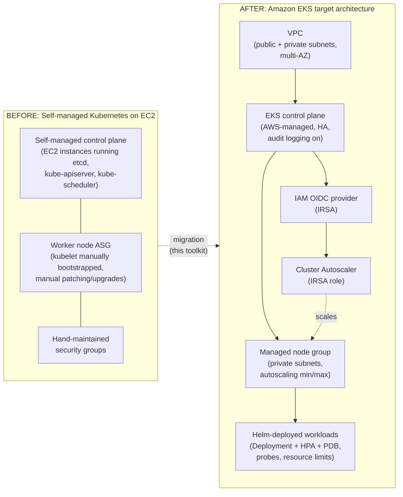

# Architecture

## From self-managed Kubernetes on EC2 to managed EKS

The diagram below mirrors the shape of a real self-managed-EC2-to-EKS
migration: a hand-rolled control plane and worker fleet on plain EC2
instances (manual etcd/API-server ops, ad hoc security groups, no managed
node lifecycle) moving to an AWS-managed EKS control plane with a managed
node group, IRSA for fine-grained pod-level IAM, and workloads deployed
through versioned Helm charts instead of one-off `kubectl apply` runs.

## Component notes

- **VPC module** (`terraform/modules/vpc`) -- multi-AZ public/private
  subnets, subnet tags required by the AWS VPC CNI and Load Balancer
  Controller, and a cost-toggleable NAT gateway.
- **EKS module** (`terraform/modules/eks`) -- managed EKS cluster with
  control-plane logging enabled, a managed node group in private subnets,
  an IAM OIDC provider for IRSA, and an example least-privilege IRSA role
  for the Kubernetes Cluster Autoscaler.
- **Helm chart** (`helm/sample-workload`) -- the deployment pattern a real
  application would follow post-migration: resource requests/limits,
  liveness/readiness probes, an HPA, and a PodDisruptionBudget.
- **Migration readiness script** (`scripts/migration-readiness-check.sh`)
  -- audits existing plain-YAML manifests (the kind typically found on a
  self-managed cluster) for patterns that don't translate cleanly to EKS
  defaults, such as `hostPath` volumes tied to a specific node.

## What this toolkit does *not* do

It does not provision real AWS infrastructure by itself and it is not a
live migration runbook for a specific workload -- it is a reference
implementation and automated test suite proving the Terraform/Helm/Bash
patterns work, ready to be adapted to a client's actual VPC layout,
compliance requirements, and application set.
